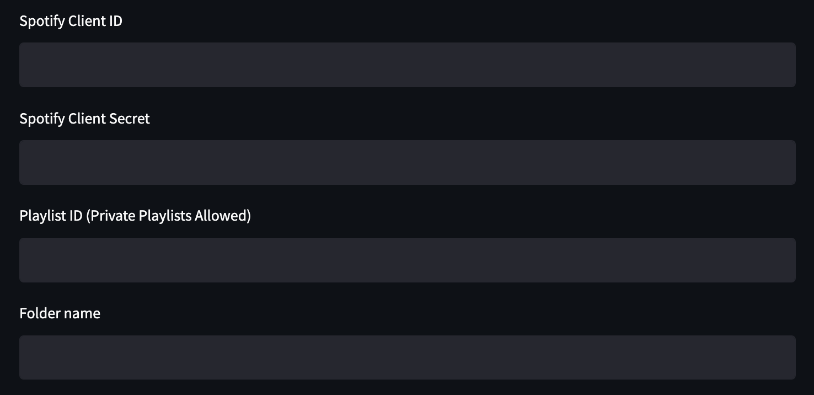
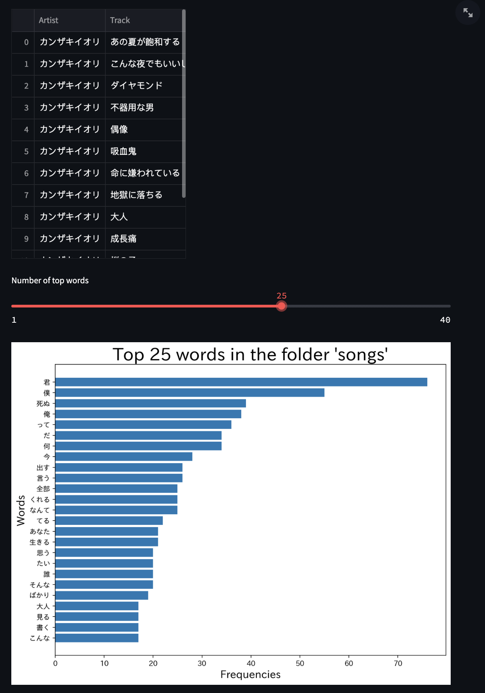

# Lyrics Frequency Visualizer for Japanese Songs

This app (made using [Streamlit](https://streamlit.io/)) takes a Spotify playlist containing Japanese songs and displays the frequencies of the most common words across all of the lyrics.

**Note:**

-   Since the code runs on your local machine, I do not collect any personal information from you.
-   Some of the song lyrics that are scraped may be different from the ones you want, so you may need to go through the files to manually update these.

## Repository contents

`images` contains the images used in the `README.md` file (i.e. the images you see below).

`notebooks` contains several `.ipynb` files that I used for testing my code.

`app.py` contains the code to run the Streamlit app, which allows the user to input their Spotify credentials.

`lyrics_visualizer.py` contains the code for accessing the Spotify API, scraping the song lyrics, and visualizing the word counts in a bar chart.

## Requirements to use this app

-   A Spotify account (does not need to be a Premium account)
-   Your Spotify client ID and client secret ([how to obtain these](https://developer.spotify.com/documentation/general/guides/authorization/app-settings/))
-   Python libraries: `streamlit`, `requests`, `re`, `time`, `os`, `base64`, `datetime`, `pandas`, `collections`, `spacy`, `advertools`, `csv`, `matplotlib.pyplot`, `japanize_matplotlib`
    -   If you don't have one or more of the following modules, then type `pip install <module>` in the terminal to install it.
    -   In addition to the `spacy` library, you will also need to download the Japanese pipeline (type the following in the terminal to download both `spacy` and the Japanese pipeline)

```{=html}
<!-- -->
```
    $ pip install -U pip setuptools wheel
    $ pip install -U spacy
    $ python -m spacy download ja_core_news_sm

## Steps

1.  Download this repository.
2.  Open the folder in an IDE (preferably Visual Studio Code).
3.  Download the libraries above as needed.
4.  Open the terminal and type the following to run the app:

```{=html}
<!-- -->
```
    $ streamlit run app.py

5.  Type in your Spotify client ID, client secret, and a [playlist ID](https://clients.caster.fm/knowledgebase/110/How-to-find-Spotify-playlist-ID.html) with Japanese songs into the corresponding fields.



6.  After the lyrics files have been downloaded (which may take a while since there is a buffer time between each scrape), a bar chart with the top word frequencies should appear. You can change the number of words you want to see using the slider.


